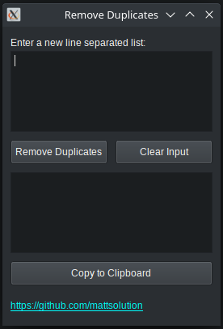

# Duplicate_remover

This simple python sript is designed to remove duplicates from a list of items. Text input a list of items (new line separated) and remove the duplicates. A copy to clipboard button allows to directly copy the clean output.

  

Duplicate remover GUI

In the future I want to ad button selaction to decide the item separator which will probably be space, new line, tab and an input text cell for a custom separator 

## Requirements
The required packages are:

[PySide2](https://pypi.org/project/PySide2/#:~:text=PySide2%20is%20the%20official%20Python,and%20an%20open%20design%20process.)

[pyperclip](https://pypi.org/project/pyperclip/)
